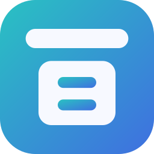
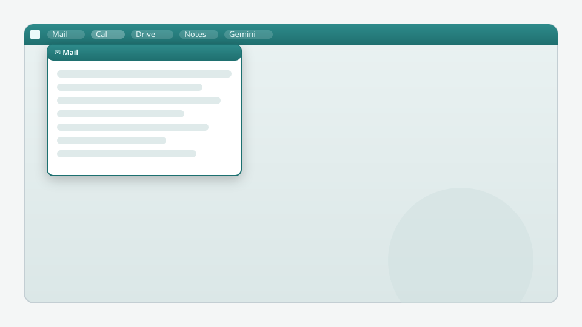

<div align="center">



# DeskHatch

A thin launcher bar that docks at the very **top edge** of your screen; click a
button and a **drawer slides down right beneath it** — your mail, calendar,
notes, files and tools, one slam-to-the-top away.

<em>画面最上部に常駐する万能ランチャーバー。ボタンを押すと真下にドロワーが開きます。</em>

<sub>📁 drag in <b>files</b> · 🔗 <b>URLs</b> · ✂ <b>text</b> &nbsp;—&nbsp; stash anything in the Clip · browse &amp; open local files · pin folders</sub>

[](https://github.com/kiwiman0706-beep/deskhatch/releases/latest)
[](https://github.com/kiwiman0706-beep/deskhatch/releases)
[](LICENSE)




</div>

---

## ✨ Why DeskHatch

- **Always within reach.** The bar lives at the screen's top edge — *slam* your
  mouse upward and you hit it without aiming (Fitts's law). Auto-hide or always-on.
- **One drawer at a time.** Click a button → a single drawer slides down beneath
  it. Pin 📌 to keep several open side by side.
- **Any web app as a drawer.** Gmail, Calendar, Keep, Tasks, Drive, Maps,
  **Gemini**, LINE WORKS, internal tools… sign in to Google **once** and they're
  all signed in.
- **Files & drag-and-drop.** **Drag a file, URL or selected text** onto the bar
  (or the macOS menu-bar icon), or use **+File / +Folder** — it's stashed in the
  **📎 Clip**. Plus an Explorer-style browser (This PC → folders), pinned folders
  and an **Apps** shortcut (Windows Start Menu / macOS Applications).
- **Built-in tools.** Editor, calculator, **timer**, **stopwatch**, clipboard
  history, bookmarks, quick web search.
- **Yours to shape.** Add / remove / reorder / edit buttons, drag to merge into
  tabs, themes (incl. classic-Mac rounded corners), multi-monitor.
- **Polished plumbing.** Windows AppBar space-reservation, **auto-update**
  (Windows), **English / 日本語** UI (auto-detected, switchable; drop-in language
  packs), system-tray Restart / Quit.

## ⬇️ Install

**Windows** — download `DeskHatch-Setup-x.y.z-x64.exe` (installer, auto-updates)
or the portable `.exe` from the [**latest release**](https://github.com/kiwiman0706-beep/deskhatch/releases/latest).
*(A winget package is on the way.)*

**macOS** — install from the terminal:

```bash
curl -fsSL https://raw.githubusercontent.com/kiwiman0706-beep/deskhatch/HEAD/scripts/install-mac.sh | bash
```

The build is not notarized (that needs a paid Apple Developer account), and on
macOS 15 (Sequoia) and later a browser-downloaded `.dmg` gets blocked — sometimes
deleted outright as "malware". The line above fetches the same release with
`curl`, which doesn't attach the quarantine attribute that triggers the check, so
the app just runs. Add `-s -- --beta` for prereleases. If you'd rather use the
`.dmg` from the [latest release](https://github.com/kiwiman0706-beep/deskhatch/releases/latest),
read [`docs/MACOS-INSTALL.md`](docs/MACOS-INSTALL.md) first — right-click → *Open*
no longer works on current macOS.

> On Windows the unsigned build may show a SmartScreen prompt on first run
> (choose *More info → Run*). The app then updates itself.

## 🖼️ Screenshots

> Drop real captures into `docs/media/` and they'll show here
> (`shot-bar.png`, `shot-drawer.png`, `shot-settings.png`).


## 🧠 How it works

A **transparent, frameless, always-on-top** strip pinned to the top edge. The
renderer toggles **click pass-through** so the desktop stays usable except over
the bar / an open drawer, and **resizes the window** to fit open drawers. Web
pages embed via `<webview>` on a shared session, so logins persist.

## 🛠️ Build from source

```bash
npm install
npm start            # run
npm test             # unit tests (pure logic)
npm run dist         # Windows installer + portable
npm run dist:mac     # macOS dmg + zip (run on a Mac)
```
Releases are cut by tagging `vX.Y.Z` (GitHub Actions builds Windows + macOS and
publishes them, plus the winget update). See `docs/PUBLISHING.md`.

### Add a drawer
Edit `src/renderer/config.js`:
```js
{ id: 'sheet', label: 'Sheet', icon: '📊', type: 'page', mobile: false, width: 900,
  url: 'https://docs.google.com/spreadsheets/d/XXXX' }
```
`type: 'page'` embeds a URL, `'folder'` pins a folder, `'files'` opens *This PC*.

### Add a language
Copy `src/renderer/locales/en.json` to e.g. `fr.json`, set `"__name__"`, translate
the values — it appears automatically in **Settings → Language**.

## 📋 Notes & limitations
- Embedded Google **Keep / Tasks** have no public API (pages only).
- The file browser is a custom cross-platform UI (not the native shell view).
- Pinned drawers can overlap; no auto-tiling yet.

## 🙏 Credits
Built with [Electron](https://www.electronjs.org/). Inspired by the **SmartCenter**
launcher bar from Lotus SuperOffice, and the classic Mac menu bar.

## 📄 License
[MIT](LICENSE) © DeskHatch
